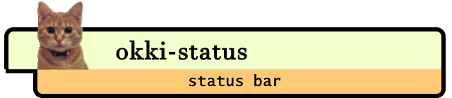
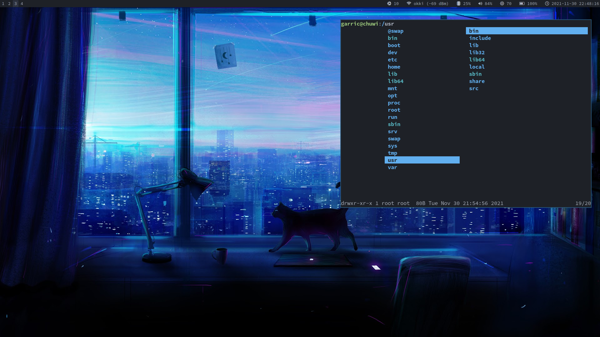

# 

## What is okki-status?

okki-status is a lightweight status bar written in Go for the Sway tiling window manager.

Here is a screenshot of it in action:



## Installation

### Packages

Coming soon...

### Manual installation

Make sure, that you have a recent Go version. The minimum required version is always declared in the `go.mod` file.

1. obtain the source:
  a. Clone with git: `git clone https://git.okki.hu/garric/okki-status` OR
  b. Download & extract the most tarball from the [releases page](https://git.okki.hu/garric/okki-status/releases)
2. switch to the source directory: `cd okki-status`
3. build&install: `sudo make clean install`

This will add the following artifacts to your system:

   * `/usr/bin/okki-status`: the main binary
   * `/usr/bin/okki-refresh`: external refresh utility
   * `/etc/okki-status/config.yaml`: a bare-bones starter configuration
   * `/etc/okki-status/example.yaml`: a full-fledged example configuration


## Configuring the status bar

Configuration is done through a single `yaml` file. The application searches the following locations (in this order of precedence) to locate the configuration file:

   1. `$XDG_CONFIG_HOME/okki-status/config.yaml`
   2. `$HOME/.config/okki-status/config.yaml`
   3. `/etc/okki-status/config.yaml`


For more details on available modules, and how to configure them check the wiki pages.


## Sway specific setup

The status bar uses the swaybar json protocol, and depends on `swaybar` built into the window manager to render the content.

To enable `okki-status` under sway, add it as your `status_command` in your sway configuration file (typically located under `$HOME/.config/sway`):

```
bar {
    status_command /usr/bin/okki-status
    # ...
}
```

Note, that you may also set global `swaybar` related settings in the above `bar` block for achieving the best appearance for the bar. An example sway configuration with recommended settings can be seen [here](https://git.okki.hu/garric/dotfiles/src/branch/main/dot_config/sway/config.d/bar).


## Testing the bar

If needed, you can test the bar outside of sway by simply running the `/usr/bin/okki-status` binary. This will print a new line to standard out of whatever the bar would render, when a render event is triggered.
```go
_Note_: only one instance of `okki-status` can run at the same time, so you will need to stop any running instances, _including_ the instances started by swaywm (`pkill okki-status`).

