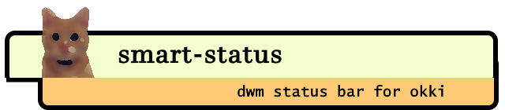

# 

## What is smart-status?
Smart-status is a simple status bar for [dwm](http://dwm.suckless.org/) written in go.

## Installation

### Packages

*Coming soon*. 

For now, build directly from source - it's easy :)

### Dependencies

Some built-in modules depend on external tools which need to be available on your system if you wish to enable them:

*  `brightness` module depends on `brillo`
*  `volume` module depends on `pamixer`
*  `wifi` module depends on `iw`

Other modules work fine without external dependencies.

### Building the binary

1.  clone or download the source code
1.  switch to the source directory
1.  run `go build`

Optional: make the compiled binary available on your system globally - for example 

```
mv smart-status /usr/local/bin
```

## Testing with debug mode
You can start the application in debug mode to test it. In debug mode it will print to STDOUT instead of the dwm status bar. This is especially useful when making changes to the configuration.
To start it in debug mode add the `--debug` command line argument:

```
smart-status --debug
```    

## Configuration

Configuration is done by modifying the `config.go` file in the root level of the source folder, and rebuilding the application.
A fully fleshed out example is provided out of the box, which you can modify according to your needs. Common operations include (but are not limited to):

*  deleting a module from the config slice
*  modifying the name of a module
*  modifying module specific properties (for example device names for wifi or battery)  
*  personalizing the icon:
    *  using a static icon
    *  using a dynamic icon which changes based on certain thresholds of the value of the module it belongs to
    *  implement a custom icon (advanced, look at `BatteryIconProvider` as an example)
*  modifying the "block order" (the order in which the text and icon appears)
*  modifying the refresh rate of the module (higher rate might cause bigger load on the CPU)
  
  
The following table summarizes the built-in modules:

| Module           | Description                                               | Special parameters  |
| ---------------- | --------------------------------------------------------- | ------------------- |
| wifi             | connected network name and signal strength                | wifi device name    |
| ram              | physical memory usage in percent                          |                     |
| volume           | volume level or muted state                               |                     |
| brightness       | display brightness percent                                |                     |
| battery          | remaining battery percent and charging state              | battery device name |
| clock            | current date/time                                         | layout              | 
     
_Note_: the **Name** and **Refresh** parameters are mandatory for each module, even though they are not displayed in the above table.
 
## Implementing a custom module

This requires go programming skills. In order to implement a custom module:

1.  Create a status provider for your module (see the `StatusProvider` interface). This is where you will implement the essence of how your module obtains the information it displays.
1.  Add a new module instance to the config slice in `config.go` and set its `Status` field to your `StatusProvider` implementation from the previous step
1.  Specify all remaining required attributes for the module.
1.  Recompile and test with `--debug`
 
## Reacting to external events

In some cases it is not efficient for the module to continuously poll the system for status updates, but we still want to react promptly to external events.

Good examples for this are the **brightness** and **volume** modules. These values rarely change *by themselves* so a relatively rare polling rate is sufficient. However when the user changes the volume or brightness manually, we want to update the status bar as promptly as possible.

For this specific scenario alone exists the `--refresh=[module-name]` command line flag. For example let's assume we have a module with the name `brightness`. Calling the application with:

```
smart-status --refresh=brightness
```

will force the brightness module to refresh its status, and thus the status bar will also reflect the change.

### Binding multimedia keys

A typical example setup for immediately updating multimedia keys will involve using `SHCMD` to follow up the bound command with `smart-status --refresh=x`.


```
## config.h (dwm sources)

[...]

static Key keys[] = {
   { 0, XF86XK_MonBrightnessUp, spawn, SHCMD("some-command; smart-status --refresh=x") },
}

[...]
```

All other multimedia keys can be configured in a similar fashion with the appropriate key-codes and module names.
An example configuration can be seen here: [dwm config.h](https://bitbucket.org/dargzero/dotfiles/src/master/dwm/config.h)