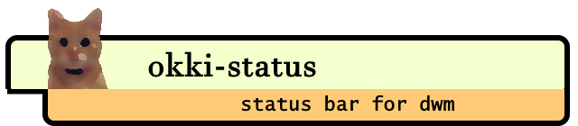

# 

## What is okki-status?

okki-status is a simple status bar for [dwm](http://dwm.suckless.org/) written in Go.
Here is a screen shot of it in action:


## Installation

### Building the binary

Make sure, that you have Go (version 1.15 or above) installed on your system.

1. clone or download the source code
2. switch to the source directory
3. build: `make build`
4. install: `make install`

Install will add the following binary to your system:

```
/usr/local/bin/okki-status
```

### Dependencies

The status bar uses the `xsetroot` program from the `xorg-xsetroot` package to interact with the Xorg root window, so this package must be installed on your system.

Some built-in modules depend on external tools which need to be available on your system if you wish to enable them:

| Module         | Dependencies                               |
| -------------- | ------------------------------------------ |
| brightness     | brillo (aur)                               |
| volume         | pamixer                                    |
| wifi           | iw                                         |
| updates        | pacman-contrib                             |

Other modules work fine without external dependencies.

### Starting the status bar with dwm

Insert the following line into your `xinit` config right before you launch dwm:

```
exec /usr/local/bin/okki-status &
```

## Configuration

### Testing with debug mode

You can start the application in debug mode to test it. In debug mode it will print to STDOUT instead of the dwm status bar. This is especially useful when making changes to the configuration.
To start it in debug mode add the `--debug` command line argument:

```
okki-status --debug
```

_Note_: only one instance of okki-status can run at the same time, so you will need to stop any running instances before starting in debug mode _including_ the instance started by your window manager.

### Modifying the default config

Configuration is done by modifying the `config.go` file in the root level of the source folder, and rebuilding the application.
A fully fleshed out example is provided out of the box, which you can modify according to your needs. Common operations include (but are not limited to):

- deleting a module from the config slice
- modifying the name of a module
- modifying module specific properties (for example device names for wifi or battery)
- personalizing the icon:
  - using a static icon
  - using a dynamic icon which changes based on certain thresholds of the value of the module it belongs to
  - implement a custom icon (advanced, look at `BatteryIconProvider` as an example)
- modifying the "block order" (the order in which the text and icon appears)
- modifying the refresh rate of the module (higher rate results in more system calls)

The following table summarizes the built-in modules:

| Module     | Description                                  | Special parameters                              |
| ---------- | -------------------------------------------- | ----------------------------------------------- |
| wifi       | connected network name and signal strength   | wifi device name                                |
| ram        | physical memory usage in percent             |                                                 |
| volume     | volume level or muted state                  |                                                 |
| brightness | display brightness percent                   |                                                 |
| battery    | remaining battery percent and charging state | battery device name                             |
| clock      | current date/time                            | layout                                          |
| updates    | displays the number of available updates     | command (must return one update per line), args |

_Note_: the **Name** and **Refresh** parameters are mandatory for each module, even though they are not displayed in the above table.

## Advanced

### Implementing a custom module

This requires go programming skills. In order to implement a custom module:

1.  Create a status provider for your module (see the `StatusProvider` interface). This is where you will implement the essence of how your module obtains the information it displays.
1.  Add a new module instance to the config slice in `config.go` and set its `Status` field to your `StatusProvider` implementation from the previous step
1.  Specify all remaining required attributes for the module.
1.  Recompile and test with `--debug`

### Reacting to external events

In some cases it is not efficient for the module to continuously poll the system for status updates, but we still want to react promptly to external events.

Good examples for this are the **brightness** and **volume** modules. These values rarely change _by themselves_ so a relatively rare polling rate is sufficient. However when the user changes the volume or brightness manually, we want to update the status bar as promptly as possible.

For this specific scenario you can use the [okki-refresh](https://github.com/garricasaurus/okki-refresh) utility. Calling `okki-refresh` can send a signal to `okki-status` to immediately refresh a given module. 

For more details, see the `okki-refresh` [readme](https://github.com/garricasaurus/okki-refresh/readme.md)

#### Binding multimedia keys

A typical example setup for immediately updating the status bar after pressing multimedia keys will involve using `SHCMD` to follow up the bound command with `okki-refresh module_name`.
Continuing with the example from the previous section using the standard dwm config:

```
## config.h (dwm source file)

[...]

static Key keys[] = {
   { 0, XF86XK_MonBrightnessUp, spawn, SHCMD("brillo -A 10; okki-refresh brightness") },
}

[...]
```

All other multimedia keys can be configured in a similar fashion with the appropriate key-codes and module names.
An example configuration can be seen here: [dwm config.h](https://bitbucket.org/dargzero/dotfiles/src/master/dwm/config.h)

#### Pacman hook

If you are using the `updates` module with `pacman`, you can set up a hook to refresh the module after each package upgrade (on Arch: `/etc/pacman.d/hooks/okki-status.hook`):

```
[Trigger]
Operation=Upgrade
Type=Package
Target=*

[Action]
Exec=/usr/local/bin/okki-refresh updates
When=PostTransaction
```
